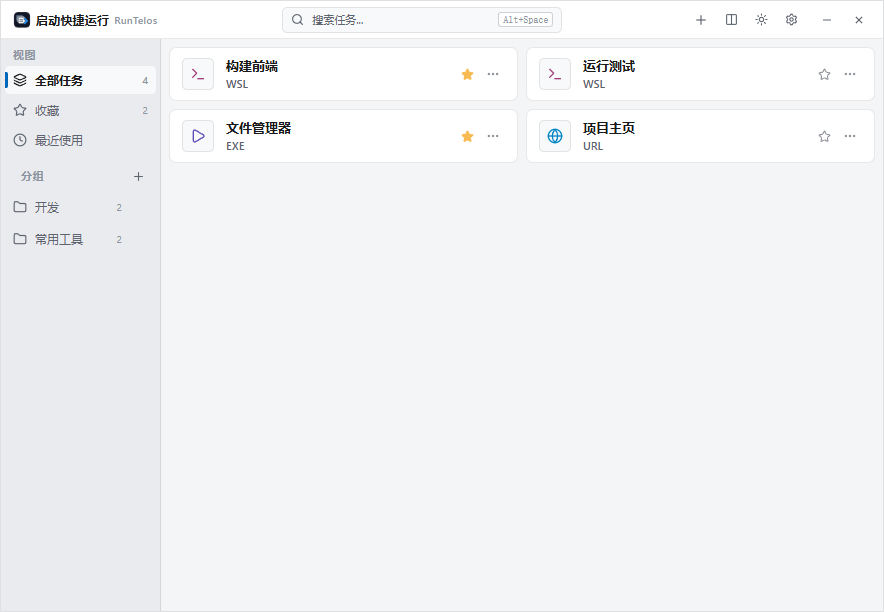
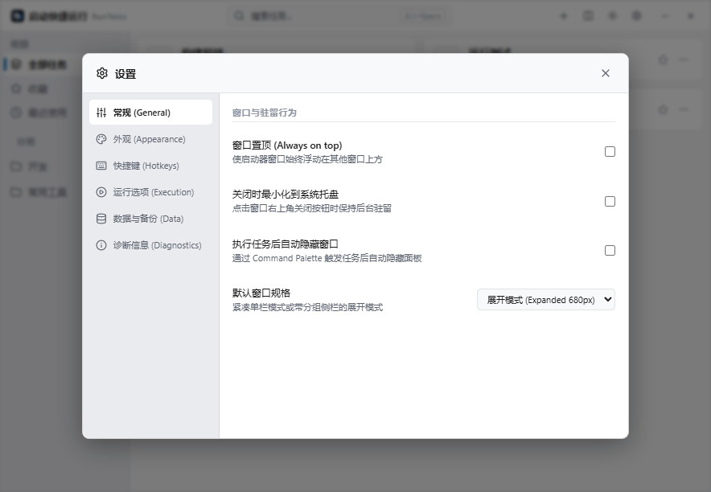

# 启动快捷运行 · RunTelos

[English](./README.en.md) · [下载最新版](https://github.com/rowanjove/RunTelos/releases/latest) · [更新记录](./CHANGELOG.md)

RunTelos 是一个面向 Windows 的本地任务启动器。它把常用脚本、程序、WSL 命令和网址整理到同一个窗口中，适合需要反复运行构建命令、维护脚本或本地工具的人。

应用不需要安装。下载单个 EXE 后直接运行，添加的任务和启动历史只保存在本机。



> 截图使用隔离配置和演示任务生成，不包含开发者或用户的真实路径、命令与历史记录。

<details>
<summary>查看设置界面</summary>



</details>

## 下载

当前版本：`0.9.1`

- [下载 RunTelos-0.9.1-portable.exe](https://github.com/rowanjove/RunTelos/releases/download/v0.9.1/RunTelos-0.9.1-portable.exe)
- [查看 SHA-256 校验值](./SHA256SUMS.txt)
- 系统要求：Windows 10/11 x64，系统中需有 Microsoft Edge WebView2 Runtime

这是未签名的开源便携程序。Windows SmartScreen 可能在首次运行时显示提醒；请从本仓库 Release 下载，并在需要时核对 SHA-256。

## 可以管理什么

| 类型 | 用途 | 运行方式 |
| --- | --- | --- |
| BAT / CMD | 构建、部署和维护脚本 | 通过 `cmd.exe` 启动 |
| PowerShell | `.ps1` 自动化脚本 | 通过 PowerShell 启动 |
| Python | `.py` 工具或后台脚本 | 可选择普通或静默模式 |
| EXE | 本地程序和命令行工具 | 直接启动目标程序 |
| WSL | Linux 工具链与 Shell 命令 | 优先使用 Windows Terminal，失败时回退到 WSL |
| URL | 文档、控制台和本地服务地址 | 使用系统默认浏览器打开 |

每个任务可以设置名称、别名、分组、参数、工作目录、收藏状态和管理员运行。脚本任务还可以选择执行后是否保留终端窗口。

## 日常使用

1. 运行便携版 EXE，点击标题栏的 `+` 或按 `Ctrl+N`。
2. 选择脚本或程序；WSL 命令和网址可直接填写。
3. 点击任务卡片运行。右键菜单可编辑、定位文件、查看错误或删除任务。
4. 使用收藏、分组和拖放排序整理任务。
5. 在窗口内按 `Alt+Space` 或 `Ctrl+F` 打开搜索；全局唤出快捷键可在设置中修改。

紧凑模式适合贴在桌面边缘，展开模式会显示分组侧栏。窗口尺寸会按两种模式分别保存。

## 运行记录与恢复

- 最近 200 条启动记录保存在本机，包括任务名、时间、成功或失败状态。
- 配置变更前会轮转最近三份自动备份。
- 配置损坏时，恢复界面可以导入配置、选择自动备份或打开配置目录。
- 配置导入会校验版本、任务类型、字段长度、重复 ID 和不匹配的数据载荷。

兼容旧版本所用的数据目录仍叫 `ScriptLauncher`：

```text
%APPDATA%\ScriptLauncher\config.json
%APPDATA%\ScriptLauncher\history.json
%APPDATA%\ScriptLauncher\window-state.json
```

## 隐私与安全边界

RunTelos 没有账号、云同步、遥测或广告，不会上传任务、路径、命令、历史记录和环境变量。除依赖安装、用户主动打开的网址外，应用本身不需要联网。

任务会获得与你手动运行相同的系统权限；选择“以管理员身份运行”时，Windows 会显示 UAC 确认。导入他人提供的配置或运行陌生脚本前，请先检查其中的路径、参数、命令和网址。

漏洞报告方式见 [SECURITY.md](./SECURITY.md)。Rust 依赖审计中的限定例外及适用边界记录在 [docs/security-advisories.md](./docs/security-advisories.md)。

## 从源码构建

需要 Node.js 20+、Rust stable、Tauri 2 的 Windows 构建依赖，以及用于完整审计的 `cargo-audit`。

```powershell
npm ci
cargo install cargo-audit --locked
npm run check
npm run build:portable
npm run verify:release
```

开发模式：

```powershell
npm run tauri dev
```

`npm run build:portable` 会执行 Tauri Release 构建，生成规范命名的便携版并刷新 `SHA256SUMS.txt`。不要把裸 `cargo build --release` 的输出作为分发文件。

## 项目结构

```text
src/                    React 界面、交互与前端测试
src-tauri/src/          Rust 配置、启动、托盘和窗口逻辑
src-tauri/capabilities/ Tauri 最小权限声明
scripts/                项目与发布产物校验
docs/                   截图和依赖安全说明
```

完整检查包含 48 项前端测试、48 项 Rust 测试、TypeScript 构建、rustfmt、Clippy `-D warnings`、npm audit 和 RustSec 审计。

## 参与开发

问题反馈和改进提交请阅读 [CONTRIBUTING.md](./CONTRIBUTING.md)。发布变化记录在 [CHANGELOG.md](./CHANGELOG.md)。

## 开源许可

RunTelos 使用 [MIT License](./LICENSE)。你可以使用、修改和分发源码，但需要保留许可证与版权声明。
